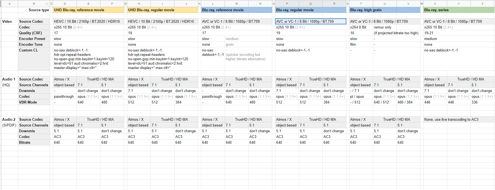

# ffmpeg with nvenc


```bash
# Deint
.\ffmpeg.exe -hwaccel cuvid -c:v h264_cuvid -deint 2 -drop_second_field 1 -i INPUT -c:v hevc_nvenc -profile main -preset slow -rc:v vbr_hq -b:v 5500k -maxrate:v 9000k -c:a copy hvec_deint.mp4

# Progressive
 .\ffmpeg.exe -c:v h264_cuvid -i INPUT  -c:v hevc_nvenc -profile main -preset slow -rc:v vbr_hq -b:v 5500k -maxrate:v 9000k -c:a copy output.mp4
```


handbreak extra settings:

[https://docs.google.com/spreadsheets/d/1u9fKNsRcLgc-1oVV5GhBgoPGO9vLpcn-x3NUgTmeC-0/edit\#gid=0](https://docs.google.com/spreadsheets/d/1u9fKNsRcLgc-1oVV5GhBgoPGO9vLpcn-x3NUgTmeC-0/edit#gid=0)



no-sao:deblock=-1,-1

